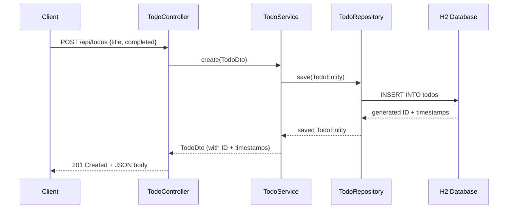

# ${{ values.componentName }}

${{ values.description }}

## Tech Stack

- **Java** 25
- **Spring Boot** 4.1.0
- **Maven** (no Gradle)
- **H2** in-memory database (dev/test), commented PostgreSQL section for production
- **Spring Security** form login baseline
- **JaCoCo** code coverage (80% threshold enforced in CI)

## Prerequisites

- Java 25 (JDK)
- Maven 3.9+

## Build

```bash
mvn clean install
```

## Run

```bash
mvn spring-boot:run
```

The application starts on `http://localhost:8080`.

## Test

```bash
mvn verify
```

This runs all tests and enforces the JaCoCo coverage threshold (80%).
The build fails if coverage drops below the threshold.

## API Documentation

All endpoints are mapped to `/api/todos` and require authentication (form login).

### Create Todo

```http
POST /api/todos
Content-Type: application/json

{
  "title": "Learn Spring Boot",
  "completed": false
}
```

**Response:** `201 Created`

```json
{
  "id": 1,
  "title": "Learn Spring Boot",
  "completed": false,
  "createdAt": "2025-01-01T00:00:00Z",
  "updatedAt": "2025-01-01T00:00:00Z"
}
```

### Get Todo by ID

```http
GET /api/todos/1
```

**Response:** `200 OK`

```json
{
  "id": 1,
  "title": "Learn Spring Boot",
  "completed": false,
  "createdAt": "2025-01-01T00:00:00Z",
  "updatedAt": "2025-01-01T00:00:00Z"
}
```

### Get All Todos

```http
GET /api/todos
```

**Response:** `200 OK`

```json
[
  {
    "id": 1,
    "title": "Learn Spring Boot",
    "completed": false,
    "createdAt": "2025-01-01T00:00:00Z",
    "updatedAt": "2025-01-01T00:00:00Z"
  }
]
```

### Update Todo

```http
PUT /api/todos/1
Content-Type: application/json

{
  "title": "Learn Spring Boot 4.x",
  "completed": true
}
```

**Response:** `200 OK`

```json
{
  "id": 1,
  "title": "Learn Spring Boot 4.x",
  "completed": true,
  "createdAt": "2025-01-01T00:00:00Z",
  "updatedAt": "2025-01-01T12:00:00Z"
}
```

### Delete Todo

```http
DELETE /api/todos/1
```

**Response:** `204 No Content`

### Error Responses

| Status Code | Description |
|-------------|-------------|
| 401         | Unauthorized — authentication required |
| 404         | Not Found — todo with given ID does not exist |

## Request Flow



## Project Structure

```
src/main/java/
  ${{ values.packagePath }}/
    Application.java              # Entry point (@SpringBootApplication)
    config/
      JpaAuditingConfig.java      # @EnableJpaAuditing (separate from Application)
      SecurityConfig.java         # Spring Security form login baseline
    todo/
      TodoEntity.java             # JPA entity with auditing
      TodoDto.java                # API request/response object
      TodoRepository.java         # Spring Data JPA repository
      TodoService.java            # Business logic + manual DTO ↔ Entity mapping
      TodoController.java         # REST controller (/api/todos)
src/test/java/
  ${{ values.packagePath }}/
    config/
      SecurityConfigTest.java     # Security filter chain test
    todo/
      TodoRepositoryTest.java     # @DataJpaTest — repository layer
      TodoServiceTest.java        # Unit test — service layer (mocked repo)
      TodoControllerTest.java     # @WebMvcTest — controller layer (mocked service)
src/main/resources/
  application.yml                 # H2 config, ECS logging, commented PostgreSQL
```

## Template Parameters

This project was generated from the `java-maven-spring-25` Backstage template.

| Parameter       | Description                          | Default                  | Required |
|-----------------|--------------------------------------|--------------------------|----------|
| componentName   | Unique name of the component          | —                        | Yes      |
| owner           | Backstage entity owner (group/user)   | —                        | Yes      |
| groupId         | Maven group ID                        | `com.example`            | No       |
| artifactId      | Maven artifact ID                     | derived from componentName | No     |
| packageName     | Base Java package name                | equals groupId           | No       |
| description     | Component description                 | provided default         | No       |

## Docker

Build the Docker image:

```bash
docker build -t ${{ values.componentName }} .
```

Run the container:

```bash
docker run -p 8080:8080 ${{ values.componentName }}
```

## CI

GitHub Actions CI runs on every pull request and push to `main`:
- Sets up Java 25
- Runs `mvn verify` (tests + JaCoCo coverage check)
- Fails if coverage drops below 80%
